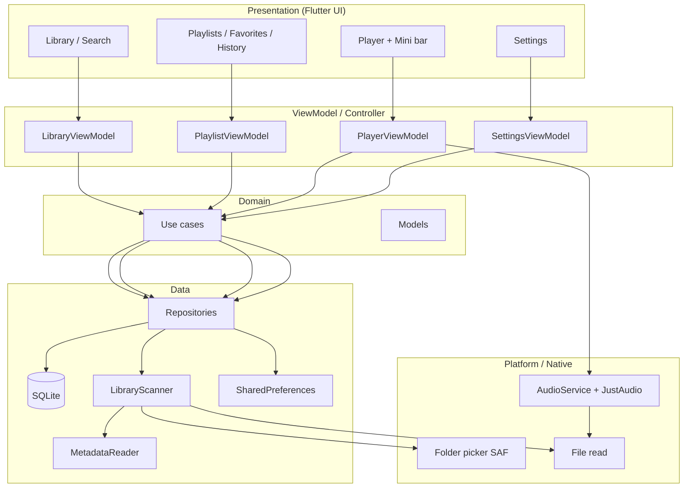
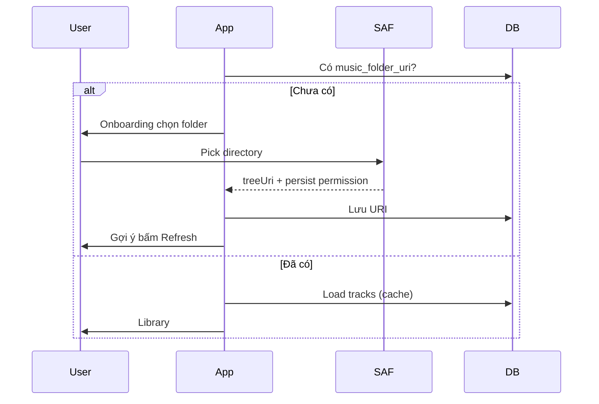

# Kiến trúc kỹ thuật — Local Music Player

> Dựa trên quyết định trong [`Thiết kế hệ thống.md`](Thiết%20kế%20hệ%20thống.md) (yêu cầu & phạm vi v1).

---

## 1. Lộ trình thiết kế (bạn đang ở đâu)

```text
[1] Yêu cầu / câu hỏi     → THIET_KE.md, traloi.md          ✓
[2] Quyết định chức năng   → Thiết kế hệ thống.md            ✓
[3] Kiến trúc kỹ thuật    → KIEN_TRUC.md (file này)         ← hiện tại
[4] Luồng màn hình / UI    → (bước sau, có thể WIREFRAME.md)
[5] Triển khai theo phase  → MVP → full v1
```

**Kiến trúc** trả lời: *code chia thế nào, dữ liệu chảy ra sao, dùng package gì, DB có bảng gì* — chưa cần viết từng widget.

---

## 2. Tổng quan hệ thống



**Nguyên tắc (theo ưu tiên của bạn):**

- **MVVM** — UI không gọi SQLite / file trực tiếp.
- **Một nguồn phát nhạc** — `AudioHandler` singleton; mọi màn hình nghe state từ đó.
- **Filesystem là source of truth cho “có file hay không”** — DB là cache + dữ liệu app (playlist, favorite, tên tùy chỉnh).

---

## 3. Các lớp (layers)

| Lớp | Trách nhiệm | Không làm |
|-----|-------------|-----------|
| **UI** | Widget, navigation, hiển thị, input | Quét folder, parse ID3, SQL |
| **ViewModel** | State UI, gọi use case, `notifyListeners` / Riverpod | Biết chi tiết path SAF |
| **Domain** | Model, use case (“RefreshLibrary”, “PlayTrack”) | Import plugin Flutter |
| **Data** | Repository, DAO, scanner, đọc tag | Logic sort phức tạp trên UI |
| **Platform** | `audio_service`, SAF, permissions | Business rules |

*Với app cá nhân, domain có thể mỏng (use case nằm trong repository) — tránh over-abstract.*

---

## 4. Cấu trúc thư mục `lib/`

```text
lib/
  main.dart
  app.dart                    # MaterialApp, theme, locale, routes

  core/
    constants/                # extensions nhạc, keys prefs
    theme/                    # Dark / Light + player gradient
    l10n/                     # ARB vi/en (hoặc easy_localization)
    utils/
    di/                       # service locator (get_it) — tùy chọn

  data/
    local/
      app_database.dart       # sqflite open + migrate
      daos/                   # tracks, playlists, ...
    models/                   # entity ↔ DB row
    repositories/
      library_repository.dart
      playlist_repository.dart
      player_repository.dart  # resume position, playback prefs
      settings_repository.dart
    services/
      folder_access_service.dart   # SAF URI, persist permission
      library_scanner.dart         # đệ quy, merge DB
      metadata_service.dart        # ID3 / duration / art extract
      backup_service.dart          # v1.1 export/import

  domain/
    models/                   # Track, Playlist, PlaybackState (pure Dart)
    enums/                    # RepeatMode, SortOption, AppTheme

  features/
    onboarding/               # lần đầu: chọn folder
    library/
      library_screen.dart
      library_view_model.dart
    player/
      player_screen.dart
      mini_player_bar.dart
      player_view_model.dart
    playlists/
    favorites/
    history/
    settings/
    track_edit/               # điền tên khi thiếu tag

  audio/
    audio_handler.dart        # extends BaseAudioHandler
    audio_controller.dart     # wrap just_audio, queue, repeat
```

---

## 5. Stack package (đề xuất v1)

| Mục đích | Package | Ghi chú |
|----------|---------|---------|
| DB | `sqflite` | SQLite |
| Folder Android | `file_picker` hoặc `saf_util` / platform channel | Chọn folder + giữ URI |
| Metadata | `flutter_media_metadata` hoặc `metadata_god` | ID3, art, duration |
| Màu artwork | `palette_generator` | dominant_color → Player gradient |
| Phát nhạc | `just_audio` | Engine |
| Nền + notification | `audio_service` | Bắt buộc cho khóa màn hình |
| State | `provider` hoặc `flutter_riverpod` | Chọn **một** — Riverpod gợi ý nếu muốn test dễ |
| DI nhẹ | `get_it` | Register singleton AudioHandler, DB |
| Prefs nhỏ | `shared_preferences` | Lần mở app, flags onboarding |
| i18n | `flutter_localizations` + ARB | VI / EN |
| Path art cache | `path_provider` | Lưu ảnh bìa extract ra file nhỏ |

**AndroidManifest:** `FOREGROUND_SERVICE`, `WAKE_LOCK` (nếu cần), quyền đọc theo API level — chủ yếu qua **SAF** nên hạn chế `MANAGE_EXTERNAL_STORAGE`.

---

## 6. Schema SQLite (v1)

### 6.1 `tracks`

| Cột | Kiểu | Mô tả |
|-----|------|--------|
| id | INTEGER PK | |
| file_uri | TEXT UNIQUE | URI/path ổn định từ SAF |
| file_name | TEXT | Tên file gốc |
| title | TEXT NULL | Từ tag |
| artist | TEXT NULL | Từ tag |
| album | TEXT NULL | |
| duration_ms | INTEGER NULL | |
| art_cache_path | TEXT NULL | File ảnh đã extract |
| dominant_color | INTEGER NULL | ARGB từ artwork — gradient Player |
| custom_title | TEXT NULL | User điền khi thiếu tag |
| custom_artist | TEXT NULL | Tùy chọn |
| missing_tags | INTEGER | 0/1 — cần user điền |
| file_modified_at | INTEGER | Để biết file đổi → re-scan metadata |
| last_seen_at | INTEGER | Lần refresh cuối thấy file |
| created_at | INTEGER | |

**Hiển thị:** `COALESCE(custom_title, title, file_name)` — tương tự artist.

### 6.2 `playlists` / `playlist_tracks`

- `playlists`: id, name, created_at, updated_at  
- `playlist_tracks`: playlist_id, track_id, position  

### 6.3 `favorites`

- track_id, added_at (PK track_id)

### 6.4 `play_history`

- id, track_id, played_at, position_ms (tùy chọn)

### 6.5 `app_settings` (key-value hoặc 1 row)

- music_folder_uri  
- sort_option  
- locale  
- theme_key (`dark` \| `light`) — palette §5 DESIGN_SYSTEM  
- theme_mode (`dark` \| `light` \| `system`) — enum **3 giá trị** từ đầu; UI v1 chỉ Dark/Light  
- repeat_mode  
- playback_speed  

### 6.6 `playback_state` (resume)

- track_id, position_ms, queue_json (nếu sau có queue), updated_at  

---

## 7. Luồng nghiệp vụ chính

### 7.1 Lần đầu mở app



### 7.2 Refresh thư viện

```text
1. User bấm Refresh
2. LibraryScanner.listAudioFilesRecursive(folderUri)
3. Với mỗi file mới / đổi modified:
     → MetadataService.read(path) → update tracks
4. Tracks trong DB mà last_seen_at < batch này → xóa (hoặc soft-delete)
5. UI reload từ DB
```

Chạy **isolate** hoặc `compute()` nếu > ~500 file để không block UI.

### 7.3 Phát nhạc

```text
User chọn bài
  → Kiểm tra missing_tags (policy: chặn hoặc cho phát — chốt sau)
  → AudioController.setSource(fileUri)
  → AudioHandler cập nhật mediaItem (title, art cho notification)
  → Ghi play_history + playback_state định kỳ (debounce position)
```

**Repeat:** enum `off | one | all` trên playlist/context hiện tại.

**Next/Prev:** index trong `currentPlayList` (library view, playlist, favorites, …) — ViewModel truyền list id + index vào Player.

### 7.4 Resume

```text
App start → đọc playback_state
  → Nếu track còn tồn tại trong DB → load source + seek position
  → Mini bar hiện trạng thái paused/playing
```

---

## 8. Audio architecture

```text
┌─────────────────────────────────────┐
│  UI: PlayerScreen, MiniPlayerBar    │
│         ↓ listen                    │
│  PlayerViewModel                    │
└──────────────┬──────────────────────┘
               ↓
┌──────────────────────────────────────┐
│  MyAudioHandler (audio_service)      │
│    - mediaItem, playbackState        │
│    - skipToNext, seek, setRepeat     │
└──────────────┬───────────────────────┘
               ↓ owns
┌──────────────────────────────────────┐
│  AudioPlayer (just_audio)            │
└──────────────────────────────────────┘
```

- **Một** `AudioHandler` đăng ký trong `main()` trước `runApp`.
- Notification / lock screen = `MediaItem` + `PlaybackState` từ handler.
- Không tạo `AudioPlayer` thứ hai ở màn khác.

---

## 9. Navigation (gợi ý)

```text
Shell (BottomNav hoặc Drawer)
  ├── Library (tab chính)
  ├── Playlists (gồm Favorites shortcut)
  ├── History
  └── Settings

Overlay: MiniPlayerBar → tap → PlayerScreen (full)
Modal: TrackEdit (thiếu tag), Playlist editor
```

---

## 10. Chia phase triển khai

| Phase | Deliverable | Ước lượng |
|-------|-------------|-----------|
| **M0** | Chọn folder + refresh + list tên file + play/pause một file | Dùng được sớm |
| **M1** | SQLite + ID3 + art + search/sort + xóa sync | Thư viện ổn |
| **M2** | audio_service + mini bar + seek + speed + repeat + resume | Nghe hàng ngày |
| **M3** | Playlist + favorite + history + settings theme/locale | Full v1 |
| **M4** | Backup export/import, lyrics | v1.1+ |

Làm **dọc từng feature** trong mỗi phase (UI + VM + repo), tránh làm hết UI rồi mới nối DB.

---

## 11. Rủi ro kỹ thuật & cách xử lý

| Rủi ro | Giảm thiểu |
|--------|------------|
| SAF URI hết hạn / đổi folder | `takePersistableUriPermission`; lưu URI string |
| Quét chậm | Isolate; chỉ re-read metadata khi `file_modified_at` đổi |
| Phát nền bị kill | `audio_service` + foreground service; hướng dẫn tắt battery optimize (settings) |
| Ảnh bìa nặng | Extract once → cache file nhỏ trong app dir |
| File FLAC lớn trên máy yếu | Stream qua just_audio; không load whole file vào RAM |

---

## 12. Việc làm ngay sau file kiến trúc

1. Chốt nốt câu hỏi mở (shuffle, volume, queue, thiếu tag → chặn phát hay không).  
2. **(Tùy chọn)** `WIREFRAME.md` — sketch 4 màn + mini bar.  
3. **Bắt code M0** — folder + list + play đơn giản, chưa playlist.

---

## 13. Liên kết tài liệu

| File | Nội dung |
|------|----------|
| `THIET_KE.md` | Câu hỏi thiết kế ban đầu |
| `traloi.md` | Câu trả lời của bạn |
| `Thiết kế hệ thống.md` | Quyết định chức năng v1 |
| `KIEN_TRUC.md` | Kiến trúc kỹ thuật (file này) |
| **`../lib/README.md`** | **Cây thư mục code + docs từng feature** |

---

*Cập nhật khi chốt thêm câu trả lời hoặc đổi stack.*
